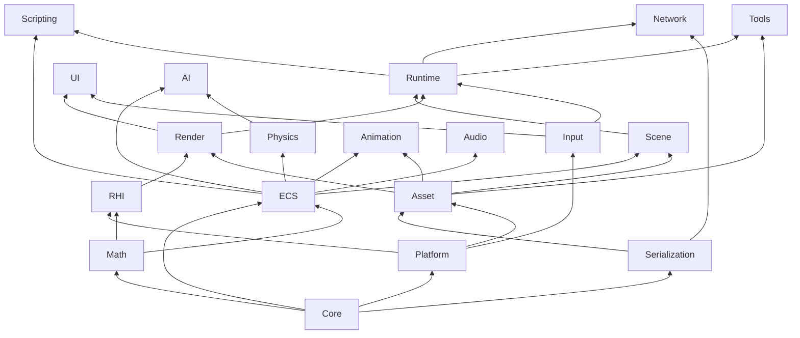

# AXYBEngine — 商用大型游戏引擎

> 专业级、模块化、可扩展的 C++ 游戏引擎架构蓝图。  
> 本文档定义**从零到完整引擎**的构建顺序，以及各模块职责边界。

---

## 一、架构总览

```
┌─────────────────────────────────────────────────────────────────┐
│                        Tools / Editor                           │
│              (编辑器、资源处理器、调试器、性能分析)                  │
├─────────────────────────────────────────────────────────────────┤
│                         Runtime                                 │
│           (Application、GameLoop、模块生命周期、启动器)            │
├──────────┬──────────┬──────────┬──────────┬──────────┬──────────┤
│   UI     │ Scripting│ Network  │    AI    │Animation │  Scene   │
├──────────┴──────────┴──────────┴──────────┴──────────┴──────────┤
│                            ECS                                  │
│              (Entity、Component、System、World)                  │
├──────────┬──────────┬──────────┬──────────┬─────────────────────┤
│  Render  │  Physics │  Audio   │  Input   │       Asset         │
├──────────┴──────────┴──────────┴──────────┴─────────────────────┤
│                            RHI                                  │
│         (Vulkan / D3D12 / Metal 抽象层)                          │
├─────────────────────────────────────────────────────────────────┤
│  Platform  │  Serialization  │  Math  │  Core                   │
│  (OS/窗口)  │  (序列化/反射)   │ (数学)  │ (内存/容器/日志/线程)    │
├─────────────────────────────────────────────────────────────────┤
│                    ThirdParty / Build / Config                   │
└─────────────────────────────────────────────────────────────────┘
```

### 设计原则

| 原则 | 说明 |
|------|------|
| **依赖单向** | 上层依赖下层，禁止反向依赖；同层通过接口通信 |
| **接口与实现分离** | 每个模块暴露 `I*` 接口，实现放在 `Impl/` 子目录 |
| **零成本抽象** | 热路径使用模板/内联，非热路径允许虚函数 |
| **数据驱动** | 游戏逻辑、资源配置、渲染管线均支持外部数据描述 |
| **编辑器优先** | 所有运行时对象必须可序列化、可在编辑器中可视化 |

---

## 二、推荐构建顺序（从零到完整引擎）

按阶段推进，**每个阶段结束前必须可编译、可运行最小 Demo**。

### 阶段 0：工程基础设施（第 1 周）

| 顺序 | 模块 | 路径 | 产出 |
|------|------|------|------|
| 0.1 | 构建系统 | `Build/` | CMake 工程、编译选项、平台宏 |
| 0.2 | 配置 | `Config/` | 引擎版本、功能开关、平台配置 |
| 0.3 | 第三方库 | `ThirdParty/` | 引入 glm、spdlog、stb 等基础依赖 |

**里程碑**：`cmake --build` 成功，输出空 `AXYBEngine.dll` / `.so`。

---

### 阶段 1：Foundation 基础层（第 2–4 周）

| 顺序 | 模块 | 路径 | 依赖 | 产出 |
|------|------|------|------|------|
| 1.1 | 核心库 | `Source/Core/` | 无 | 内存分配器、容器、字符串、日志、断言、时间 |
| 1.2 | 数学库 | `Source/Math/` | Core | Vector/Matrix/Quaternion、AABB、Ray、Transform |
| 1.3 | 平台抽象 | `Source/Platform/` | Core | 文件系统、路径、动态库、线程、同步原语 |
| 1.4 | 序列化 | `Source/Serialization/` | Core | 二进制/JSON 归档、类型注册、反射基础 |

**里程碑**：单元测试全部通过；可读写 JSON 配置文件。

---

### 阶段 2：窗口与输入（第 5–6 周）

| 顺序 | 模块 | 路径 | 依赖 | 产出 |
|------|------|------|------|------|
| 2.1 | 窗口系统 | `Source/Platform/Window/` | Platform | 窗口创建、事件循环、全屏/分辨率 |
| 2.2 | 输入系统 | `Source/Input/` | Platform, Core | 键盘/鼠标/手柄、输入映射、Action 系统 |

**里程碑**：弹出空白窗口，按 ESC 退出。

---

### 阶段 3：图形管线底层（第 7–12 周）

| 顺序 | 模块 | 路径 | 依赖 | 产出 |
|------|------|------|------|------|
| 3.1 | RHI 抽象 | `Source/RHI/` | Platform, Core | Device、CommandBuffer、Buffer、Texture、Pipeline |
| 3.2 | Shader 管理 | `Shaders/` + `Source/RHI/Shader/` | RHI | HLSL/GLSL 编译、反射、宏变体 |
| 3.3 | 渲染器 | `Source/Render/` | RHI, Math | RenderGraph、材质、网格、相机、光照 |
| 3.4 | 资源管线 | `Source/Asset/` | Serialization, Platform | 导入器、Cook、运行时加载、引用计数 |

**里程碑**：加载 glTF/OBJ 模型，渲染带 PBR 光照的场景。

---

### 阶段 4：世界与实体系统（第 13–16 周）

| 顺序 | 模块 | 路径 | 依赖 | 产出 |
|------|------|------|------|------|
| 4.1 | ECS | `Source/ECS/` | Core, Math | Entity、Component、System、World、Query |
| 4.2 | 场景管理 | `Source/Scene/` | ECS, Asset | Scene、Level、Prefab、层级变换 |
| 4.3 | 运行时框架 | `Source/Runtime/` | 以上全部 | Application、ModuleManager、GameLoop、Tick 阶段 |

**里程碑**：通过代码或 JSON 加载场景，实体在 GameLoop 中 Tick。

---

### 阶段 5：物理与动画（第 17–20 周）

| 顺序 | 模块 | 路径 | 依赖 | 产出 |
|------|------|------|------|------|
| 5.1 | 物理引擎 | `Source/Physics/` | Math, ECS | 刚体、碰撞体、射线检测、物理 World |
| 5.2 | 动画系统 | `Source/Animation/` | ECS, Asset | 骨骼动画、状态机、蒙皮、Blend Tree |

**里程碑**：角色在场景中行走、碰撞、播放动画。

---

### 阶段 6：音频、UI、脚本（第 21–24 周）

| 顺序 | 模块 | 路径 | 依赖 | 产出 |
|------|------|------|------|------|
| 6.1 | 音频 | `Source/Audio/` | Platform, Asset | AudioDevice、Sound、Listener、3D 音效 |
| 6.2 | UI 框架 | `Source/UI/` | Render, Input | Canvas、Widget、布局、字体渲染 |
| 6.3 | 脚本系统 | `Source/Scripting/` | ECS, Runtime | Lua/C# VM 绑定、热重载 |

**里程碑**：播放背景音乐；显示 HUD；脚本驱动实体行为。

---

### 阶段 7：AI 与网络（第 25–28 周）

| 顺序 | 模块 | 路径 | 依赖 | 产出 |
|------|------|------|------|------|
| 7.1 | AI 系统 | `Source/AI/` | ECS, Physics | NavMesh、行为树、感知、寻路 |
| 7.2 | 网络 | `Source/Network/` | Runtime, Serialization | 会话、复制、RPC、预测回滚 |

**里程碑**：AI 敌人巡逻追击；局域网双人联机 Demo。

---

### 阶段 8：工具链与编辑器（第 29–36 周）

| 顺序 | 模块 | 路径 | 依赖 | 产出 |
|------|------|------|------|------|
| 8.1 | 资源处理器 | `Source/Tools/AssetProcessor/` | Asset | 批量导入、Cook 管线、依赖分析 |
| 8.2 | 调试工具 | `Source/Tools/Debugger/` | Runtime | 内存分析、Draw Call 统计、ECS 检视 |
| 8.3 | 编辑器 | `Source/Tools/Editor/` | 全部 | 视口、层级面板、属性面板、资源浏览器 |

**里程碑**：完全通过编辑器搭建关卡并 Play-In-Editor。

---

### 阶段 9：质量与示例（持续）

| 顺序 | 模块 | 路径 | 依赖 | 产出 |
|------|------|------|------|------|
| 9.1 | 单元/集成测试 | `Tests/` | 各模块 | GoogleTest 覆盖核心路径 |
| 9.2 | 示例项目 | `Samples/` | Runtime | HelloTriangle、ThirdPerson、Networking |
| 9.3 | 默认资源 | `Assets/` | Asset | 默认 Shader、字体、图标 |

**里程碑**：CI 全绿；新用户 30 分钟内跑通 Sample。

---

## 三、模块依赖关系图



---

## 四、目录索引

| 路径 | 职责 |
|------|------|
| `Build/` | CMake、编译脚本、CI 配置 |
| `Config/` | 引擎全局配置、平台特性开关 |
| `ThirdParty/` | 第三方依赖（只读引用） |
| `Source/Core/` | 内存、容器、日志、线程、基础类型 |
| `Source/Math/` | 线性代数、几何、随机数 |
| `Source/Platform/` | OS 抽象、窗口、文件、动态库 |
| `Source/Serialization/` | 归档、反射、版本迁移 |
| `Source/Input/` | 输入设备与 Action 映射 |
| `Source/RHI/` | 图形 API 抽象 |
| `Source/Render/` | 高层渲染、材质、RenderGraph |
| `Source/Asset/` | 资源导入、Cook、运行时管理 |
| `Source/ECS/` | 实体组件系统 |
| `Source/Scene/` | 场景、关卡、Prefab |
| `Source/Physics/` | 物理模拟与碰撞 |
| `Source/Animation/` | 骨骼动画与状态机 |
| `Source/Audio/` | 音频播放与混音 |
| `Source/UI/` | 界面框架 |
| `Source/Scripting/` | 脚本语言绑定 |
| `Source/AI/` | 导航与行为 AI |
| `Source/Network/` | 多人联机 |
| `Source/Runtime/` | 应用生命周期与 GameLoop |
| `Source/Tools/` | 编辑器与工具链 |
| `Shaders/` | 引擎 Shader 源码 |
| `Tests/` | 自动化测试 |
| `Samples/` | 示例游戏项目 |
| `Assets/` | 引擎内置资源 |

---

## 五、各阶段 AI 协作提示词

> 以下提示词按构建顺序排列。向 AI 提问时，**附上对应文件夹的 README** 和当前已完成模块列表，效果更佳。

---

### 阶段 0 — 工程基础设施

**Build/**
```
我正在开发名为 AXYBEngine 的 C++20 商用游戏引擎。请帮我设计 CMake 顶层工程结构：
- 支持 Windows (MSVC)、Linux (GCC)、macOS (Clang) 三平台
- 输出静态库 AXYBEngine_Core、动态库 AXYBEngine_Runtime
- 集成 vcpkg 或 FetchContent 管理依赖
- 提供 Debug / Release / RelWithDebInfo 配置
- 开启 /W4 警告、LTO 可选、SAN 可选
请给出根 CMakeLists.txt 和各子目录 CMakeLists.txt 模板，并说明编译顺序。
```

**Config/**
```
为 AXYBEngine 游戏引擎设计配置系统：
- 引擎版本号、功能宏开关（AXYB_ENABLE_VULKAN 等）
- 平台检测宏（AXYB_PLATFORM_WINDOWS 等）
- 从 Config/Engine.ini 加载运行时配置
- 支持编译期与运行期双层配置
请给出 Config 目录文件布局和各配置项清单。
```

**ThirdParty/**
```
为 AXYBEngine 选型并集成以下第三方库，给出 vcpkg.json 或 CMake FetchContent 方案：
- 数学：glm 或自研 Math 互补
- 日志：spdlog
- 图片：stb_image
- 网格：tinygltf 或 assimp
- 物理：Jolt Physics 或 PhysX
- 音频：miniaudio 或 FMOD 封装
- 脚本：sol2 + Lua 或 Mono
- 测试：GoogleTest
说明每个库的许可证、封装层位置和链接方式。
```

---

### 阶段 1 — Foundation

**Source/Core/**
```
为 AXYBEngine 实现 Core 模块（C++20），参考 UE/Unity 底层设计：
- IAllocator / LinearAllocator / PoolAllocator / SystemAllocator
- 容器：Array、HashMap、String、StringView（不使用 std 热路径）
- 日志：ILogger、LogCategory、多 Sink（控制台/文件）
- 断言：AXYB_CHECK、AXYB_ENSURE
- 时间：Timer、Clock、FrameTimer
- 线程：Thread、Mutex、RWLock、TaskQueue（线程池）
- GUID、Result<T,E> 错误处理
请给出类图、头文件列表、关键接口定义，并说明模块间依赖。
```

**Source/Math/**
```
为 AXYBEngine 实现 Math 模块：
- Vector2/3/4、Matrix3x3/4x4、Quaternion
- Transform（位置/旋转/缩放，TRS 组合）
- AABB、OBB、Sphere、Plane、Ray、Frustum
- 工具函数：Lerp、Slerp、LookAt、Decompose
- SIMD 优化路径（SSE/NEON）可选
要求：列主序、与 GPU 一致、header-only 或 .cpp 分离
请给出完整类清单和与 Core 的接口边界。
```

**Source/Platform/**
```
为 AXYBEngine 实现 Platform 抽象层：
- IFileSystem：读写、目录遍历、路径规范化
- IDynamicLibrary：dlopen/LoadLibrary 封装
- IThread：平台线程 API 封装
- IWindow：窗口创建、事件泵（Win32/SDL3 后端）
- 平台宏与能力查询（CPU 核心数、内存大小）
请给出接口定义、Windows 首实现、以及 Window 子模块划分。
```

**Source/Serialization/**
```
为 AXYBEngine 实现 Serialization 模块：
- IArchive 读写接口（Binary / Json 两种实现）
- 类型注册表 TypeRegistry（RTTI 或手动注册）
- 版本迁移 VersionMigrator
- 对象引用 ObjectRef<T> 与 GUID 解析
- 支持 ECS Component、Asset 元数据序列化
请设计类层次，并给出 Prefab 序列化示例 JSON 结构。
```

---

### 阶段 2 — 窗口与输入

**Source/Platform/Window/**（Platform README 内）
```
在 AXYBEngine Platform 模块中实现 Window 子系统：
- IWindow：Create、Destroy、PollEvents、SetTitle、SetSize
- 事件：OnResize、OnClose、OnFocus
- 支持 Win32 原生或 SDL3 后端
- 与 RHI SwapChain 对接的 HWND/NSView 获取
请给出 Window 类设计与事件分发流程。
```

**Source/Input/**
```
为 AXYBEngine 实现 Input 模块：
- IInputDevice：Keyboard、Mouse、Gamepad
- InputAction：命名动作（Jump、Move）映射到按键/轴
- InputContext：上下文切换（Gameplay / UI）
- 输入缓冲与帧对齐
参考 Unity Input System 或 UE Enhanced Input 设计
请给出类清单、Action 配置 JSON 格式、与 GameLoop 集成方式。
```

---

### 阶段 3 — 图形管线

**Source/RHI/**
```
为 AXYBEngine 实现 RHI（Render Hardware Interface）：
- IDevice、ICommandQueue、ICommandBuffer
- IBuffer、ITexture、ISampler、IRenderPass、IFramebuffer
- IPipelineState、IShader、IDescriptorSet
- ISwapChain、Fence、Semaphore
首后端：Vulkan 或 D3D12，设计后端无关接口
参考 UE RHI 或 bgfx 架构
请给出接口清单、资源生命周期、多线程录制命令缓冲流程。
```

**Shaders/**
```
为 AXYBEngine 设计 Shader 目录结构：
- Common/：公共头文件（Math、Lighting、BRDF）
- PBR/：Forward+ 或 Deferred 管线
- PostProcess/：Bloom、ToneMapping、FXAA
- UI/：2D 着色
- Compute/：Culling、Particles
请给出命名规范、#include 规则、与 RHI Shader 编译流程对接方式。
```

**Source/Render/**
```
为 AXYBEngine 实现 Render 高层模块：
- RenderGraph：Pass 依赖、资源屏障自动插入
- Material：Shader 变体、参数块（UBO）
- Mesh：VertexBuffer、IndexBuffer、SubMesh
- Camera、Light（Directional/Point/Spot）
- SceneRenderer：收集 DrawCall、排序、提交 RHI
支持 Forward+ PBR，预留 Deferred 扩展
请给出类图、一帧渲染流程、与 ECS MeshRendererComponent 对接。
```

**Source/Asset/**
```
为 AXYBEngine 实现 Asset 模块：
- AssetManager：加载、卸载、引用计数、异步 IO
- Importer：TextureImporter、MeshImporter、AudioImporter
- Cooker：开发资源 → 运行时包（.axpak）
- AssetHandle<T>、依赖图、热重载
- 元数据 .axmeta sidecar 文件
请给出资源管线流程图、目录约定、与 Editor 协作接口。
```

---

### 阶段 4 — 世界与实体

**Source/ECS/**
```
为 AXYBEngine 实现 ECS（参考 EnTT / Flecs / UE Mass）：
- Entity（轻量 ID）、Component（POD 数据）、System（逻辑）
- World：CreateEntity、AddComponent、RemoveComponent
- Query：按 Component 签名查询
- ComponentPool：SoA 布局、缓存友好
- SystemScheduler：依赖排序、并行 System
请给出类设计、与 Scene 模块边界、序列化 Component 方案。
```

**Source/Scene/**
```
为 AXYBEngine 实现 Scene 模块：
- Scene：实体容器、根节点
- Level：子场景加载/卸载（流式）
- Prefab：实体模板实例化
- TransformComponent 层级父子关系
- SceneSerializer：场景 ↔ JSON/.axscene
请给出场景图结构、Prefab 覆盖（Override）机制、与 Editor 层级面板数据模型。
```

**Source/Runtime/**
```
为 AXYBEngine 实现 Runtime 模块：
- Application：Init、Run、Shutdown
- ModuleManager：模块注册、依赖排序、生命周期
- GameLoop 阶段：Input → FixedUpdate → Update → Render → Present
- FrameAllocator：每帧重置的临时内存
- EngineContext：全局服务定位器
请给出主循环伪代码、模块接口 IModule、启动参数与配置加载顺序。
```

---

### 阶段 5 — 物理与动画

**Source/Physics/**
```
为 AXYBEngine 实现 Physics 模块（可封装 Jolt/PhysX）：
- PhysicsWorld：重力、步进、碰撞层
- RigidBodyComponent、ColliderComponent（Box/Sphere/Capsule/Mesh）
- Raycast、Overlap、Trigger 事件
- 与 ECS System 同步 Transform
请给出组件设计、物理材质、碰撞矩阵、Fixed Timestep 集成。
```

**Source/Animation/**
```
为 AXYBEngine 实现 Animation 模块：
- Skeleton、Bone、SkinWeights
- AnimationClip：关键帧曲线
- Animator：状态机、过渡、Blend Tree
- SkinnedMeshRenderer 与 Render 对接
请给出状态机 JSON 配置格式、蒙皮 GPU 路径、与 Asset 骨架资源格式。
```

---

### 阶段 6 — 音频、UI、脚本

**Source/Audio/**
```
为 AXYBEngine 实现 Audio 模块：
- IAudioDevice：初始化、Master Volume
- Sound / SoundInstance：2D/3D 播放、循环、淡入淡出
- AudioListenerComponent：与 Camera 同步
- AudioSourceComponent、AudioClip 资源
请给出混音架构、3D 衰减模型、与 Asset 音频导入格式。
```

**Source/UI/**
```
为 AXYBEngine 实现 UI 模块：
- Canvas：Screen Space / World Space
- Widget 层次：Panel、Button、Text、Image、Slider
- 布局：锚点、Flex 或简易布局
- 字体渲染：FreeType + 图集
- 输入路由：与 Input Context UI 层
请给出 Retained Mode UI 类设计、与 Render 批处理对接、主题样式系统。
```

**Source/Scripting/**
```
为 AXYBEngine 实现 Scripting 模块（Lua + sol2）：
- ScriptEngine：VM 生命周期
- 绑定：Entity、Transform、Input、Timer API
- ScriptComponent：每实体挂载 .lua 文件
- 热重载：文件监视、重新加载
请给出绑定宏设计、脚本目录约定、与 ECS System 调用时机。
```

---

### 阶段 7 — AI 与网络

**Source/AI/**
```
为 AXYBEngine 实现 AI 模块：
- NavMesh：烘焙、寻路（A*）、动态障碍
- BehaviorTree：Selector/Sequence/Decorator 节点
- Blackboard：共享数据
- Perception：视觉/听觉感知锥
- AIControllerComponent
请给出行为树 JSON 格式、与 Physics NavMesh 烘焙流程、ECS System 更新顺序。
```

**Source/Network/**
```
为 AXYBEngine 实现 Network 模块：
- NetworkManager：Host/Client/Listen Server
- Replication：Component 属性自动同步
- RPC：ServerRPC / ClientRPC
- 预测与回滚（可选）
- 会话：房间、玩家生成
请给出网络架构选型（ENet/KCP）、序列化协议、与 ECS 复制模型。
```

---

### 阶段 8 — 工具链

**Source/Tools/AssetProcessor/**
```
为 AXYBEngine 实现命令行资源处理器 AXYBAssetProcessor：
- 监视 Assets/ 目录变更
- 调用 Importer 批量 Cook
- 输出依赖报告与错误日志
- CI 集成：headless 全量 Cook
请给出 CLI 参数设计、多进程 Cook、增量 Cook 哈希策略。
```

**Source/Tools/Debugger/**
```
为 AXYBEngine 实现运行时调试器：
- ImGui 叠加层：FPS、内存、Draw Call
- ECS 检视器：实体列表、Component 编辑
- 控制台：日志过滤、CVar 运行时修改
- 性能标记：CPU/GPU Profiler 时间轴
请给出 ImGui 集成点、Remote Debugger 可选架构。
```

**Source/Tools/Editor/**
```
为 AXYBEngine 实现关卡编辑器（参考 UE Editor 精简版）：
- EditorApplication：继承 Runtime，增加编辑模式
- 视口：场景渲染、Gizmo、相机飞行
- 面板：Hierarchy、Inspector、Asset Browser、Console
- 命令：Undo/Redo、Copy/Paste、Prefab 编辑
- 序列化：编辑结果保存为 .axscene
请给出编辑器模块划分、Qt 或 ImGui 选型、与 Runtime 代码共享策略。
```

---

### 阶段 9 — 测试与示例

**Tests/**
```
为 AXYBEngine 建立测试体系：
- Tests/Core/：Allocator、Container 单元测试
- Tests/Math/：矩阵、四元数精度测试
- Tests/ECS/：Query、System 集成测试
- Tests/Render/：Headless RHI 截图对比（可选）
CMake 集成 GoogleTest，CI 用 ctest 运行
请给出测试目录结构、Mock 平台层方案、覆盖率目标。
```

**Samples/**
```
为 AXYBEngine 创建示例项目 Samples/：
1. HelloTriangle：最小 RHI 示例
2. ThirdPerson：角色控制、动画、相机
3. Networking：双人联机射击
每个 Sample 独立 CMake target，链接 AXYBEngine_Runtime
请给出各 Sample 的功能清单、资源需求、学习路径顺序。
```

**Assets/**
```
规划 AXYBEngine 内置 Assets/ 目录：
- Shaders/、Fonts/、Icons/、DefaultMaterials/
- 版本管理与 Git LFS 策略
- 与 Cook 输出目录的关系
请给出目录树、LICENSE 合规、发布打包方式。
```

---

## 六、命名与代码规范（全局）

- **命名空间**：`AXYB::Core`、`AXYB::Render` …
- **接口**：`I` 前缀，如 `IRenderDevice`
- **实现**：`VulkanRenderDevice`、`D3D12RenderDevice`
- **组件**：`XxxComponent`，系统：`XxxSystem`
- **资源**：`XxxAsset` / `XxxHandle`
- **宏**：`AXYB_*`，配置：`AXYB_ENABLE_*`

---

## 七、许可证建议

- 引擎核心：专有或 MIT/Apache 2.0（根据商业策略）
- 第三方库：逐一核对许可证兼容性（见 `ThirdParty/README.md`）

---

*AXYBEngine Architecture v1.0 — 按阶段推进，每阶段可交付。*
